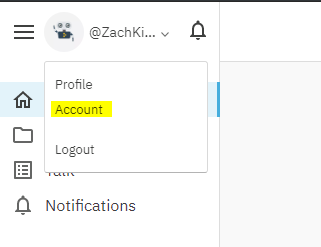
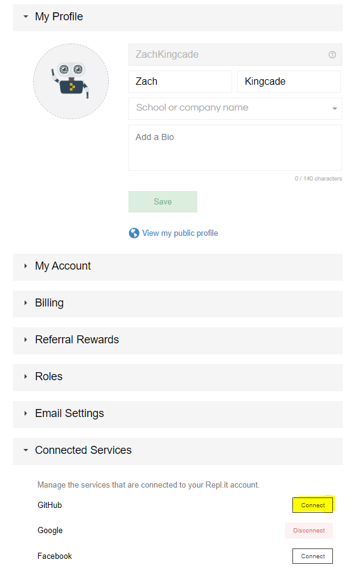

While you can always clone a repo to make or add to a repl, know as "repl from repo", you can also link your Repl.it and Github accounts so that you can push and pull code from your repository as you work on repl.it. This solution might be useful when using public computers such as school lab computers that may or may not have the compiler you or know on them.

# Prerequisites
-A Github account

-A Repl.it account

# Linking Repl.it to Github
### Step 01:
To start off already be logged into whichever device you are trying to use to thing your Repl.it and Github accounts.
### Step 02:
Go to the accounts section of your repl.it homepage.

located here:


### Step 03:
It should show a section for "Connected Services", open this tab and click to connect Github.


It should automatically connect your accounts assuming your logged into github on the device being used, otherwise it will take you to a login screen where you will need to log into Github.

### Step 04:
Go ahead and create a repl from a pre-existing repo. Now instead of just cloning it you can push and pull from your repository as well. It also has some version and commit control features. Lastly if you create an empty repository or sometimes just for no reason (this feature is in beta afterall) it will not link the language properly. When this happens you must create a folder called ".replit" in your repl and add what langauage your using, here you can also customize what command repl.it uses to run your code, as shown below.
```.replit
language = "cpp"
run = "g++ main.cpp -o main"
```
Note: all language will have diffrent command to run and diffrent parameters to set so please don't just copy mine. Get someone to help you or google it, I promise it will save you alot of headache.
